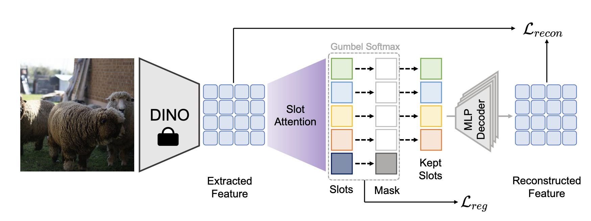

#  Official PyTorch Implementation of Adaptive Slot Attention: Object Discovery with Dynamic Slot Number
[](https://arxiv.org/abs/2406.09196)[](https://kfan21.github.io/AdaSlot/)
> [**Adaptive Slot Attention: Object Discovery with Dynamic Slot Number**](https://arxiv.org/abs/2406.09196)<br>
>  [Ke Fan](https://kfan21.github.io/), [Zechen Bai](https://www.baizechen.site/), [Tianjun Xiao](http://tianjunxiao.com/), [Tong He](https://hetong007.github.io/), [Max Horn](https://expectationmax.github.io/), [Yanwei Fu†](http://yanweifu.github.io/), [Francesco Locatello](https://www.francescolocatello.com/), [Zheng Zhang](https://scholar.google.com/citations?hl=zh-CN&user=k0KiE4wAAAAJ)


This is the official implementation of the CVPR'24 paper [Adaptive Slot Attention: Object Discovery with Dynamic Slot Number]([CVPR 2024 Open Access Repository (thecvf.com)](https://openaccess.thecvf.com/content/CVPR2024/html/Fan_Adaptive_Slot_Attention_Object_Discovery_with_Dynamic_Slot_Number_CVPR_2024_paper.html)).

## Introduction



Object-centric learning (OCL) uses slots to extract object representations, enhancing flexibility and interpretability. Slot attention, a common OCL method, refines slot representations with attention mechanisms but requires predefined slot numbers, ignoring object variability. To address this, a novel complexity-aware object auto-encoder framework introduces adaptive slot attention (AdaSlot), dynamically determining the optimal slot count based on data content through a discrete slot sampling module. A masked slot decoder suppresses unselected slots during decoding. Extensive testing shows this framework matches or exceeds fixed-slot models, adapting slot numbers based on instance complexity and promising further research opportunities.

## News!
- [2024.11.02] We released the pre-trained checkpoints! Please find them at this [link](https://drive.google.com/drive/folders/1SRKE9Q5XF2UeYj1XB8kyjxORDmB7c7Mz)!
- [2024.08.24] We open-sourced the code!

## Development Setup

Installing AdaSlot requires at least python3.8. Installation can be done using [poetry](https://python-poetry.org/docs/#installation).  After installing `poetry`, check out the repo and setup a development environment:

```bash
# install python3.8
sudo apt update
sudo apt install software-properties-common
sudo add-apt-repository ppa:deadsnakes/ppa
sudo apt install python3.8

# install poetry with python3.8
curl -sSL https://install.python-poetry.org | python3.8 - --version 1.2.0
## add poetry to environment variable

# create virtual environment with poetry
cd $code_path
poetry install -E timm
```

This installs the `ocl` package and the cli scripts used for running experiments in a poetry managed virtual environment. Activate the poetry virtual environment `poetry shell` before running the experiments.

## Running experiments

Experiments are defined in the folder `configs/experiment` and can be run
by setting the experiment variable. For example, if we run OC-MOT on Cater dataset, we can follow: 

```bash
poetry shell

python -m ocl.cli.train +experiment=projects/bridging/dinosaur/movi_e_feat_rec_vitb16.yaml
python -m ocl.cli.train +experiment=projects/bridging/dinosaur/movi_e_feat_rec_vitb16_adaslot.yaml +load_model_weight=PATH-TO-KMAX-SLOT-CHECKPOINT
python -m ocl.cli.eval +experiment=projects/bridging/dinosaur/movi_e_feat_rec_vitb16_adaslot_eval.yaml ++load_checkpoint=PATH-TO-ADASLOT-CHECKPOINT

python -m ocl.cli.train +experiment=projects/bridging/dinosaur/movi_c_feat_rec_vitb16.yaml
python -m ocl.cli.train +experiment=projects/bridging/dinosaur/movi_c_feat_rec_vitb16_adaslot.yaml +load_model_weight=PATH-TO-KMAX-SLOT-CHECKPOINT
python -m ocl.cli.eval +experiment=projects/bridging/dinosaur/movi_c_feat_rec_vitb16_adaslot_eval.yaml ++load_checkpoint=PATH-TO-ADASLOT-CHECKPOINT

python -m ocl.cli.train +experiment=projects/bridging/dinosaur/coco_feat_rec_dino_base16.yaml
python -m ocl.cli.train +experiment=projects/bridging/dinosaur/coco_feat_rec_dino_base16_adaslot.yaml +load_model_weight=PATH-TO-KMAX-SLOT-CHECKPOINT
python -m ocl.cli.eval +experiment=projects/bridging/dinosaur/coco_feat_rec_dino_base16_adaslot_eval.yaml ++load_checkpoint=PATH-TO-ADASLOT-CHECKPOINT

python -m ocl.cli.train +experiment=slot_attention/clevr10.yaml
python -m ocl.cli.train +experiment=slot_attention/clevr10_adaslot.yaml +load_model_weight=PATH-TO-KMAX-SLOT-CHECKPOINT
python -m ocl.cli.eval +experiment=slot_attention/clevr10_adaslot_eval.yaml ++load_checkpoint=PATH-TO-ADASLOT-CHECKPOINT
```

The result is saved in a timestamped subdirectory in `outputs/<experiment_name>`, i.e. `outputs/OC-MOT/cater/<date>_<time>` in the above case. The prefix path `outputs` can be configured using the `experiment.root_output_path` variable.

## Citation

Please cite our paper if you find this repo useful!

```bibtex
@inproceedings{fan2024adaptive,
  title={Adaptive slot attention: Object discovery with dynamic slot number},
  author={Fan, Ke and Bai, Zechen and Xiao, Tianjun and He, Tong and Horn, Max and Fu, Yanwei and Locatello, Francesco and Zhang, Zheng},
  booktitle={Proceedings of the IEEE/CVF Conference on Computer Vision and Pattern Recognition},
  pages={23062--23071},
  year={2024}
}
```

Related projects that this paper is developed upon:

```bibtex
@misc{oclf,
  author = {Max Horn and Maximilian Seitzer and Andrii Zadaianchuk and Zixu Zhao and Dominik Zietlow and Florian Wenzel and Tianjun Xiao},
  title = {Object Centric Learning Framework (version 0.1)},
  year  = {2023},
  url   = {https://github.com/amazon-science/object-centric-learning-framework},
}
```

